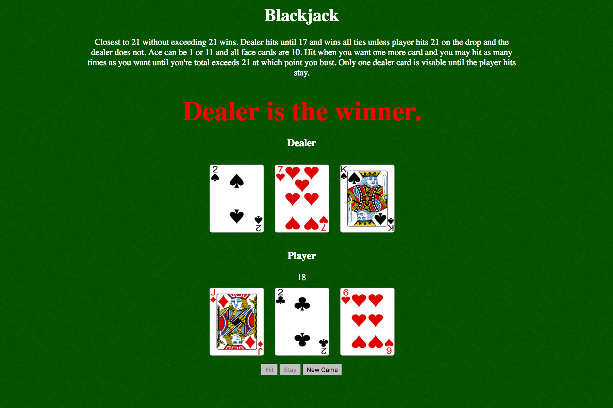

BlackJack

Objective: Demonstrate a fully functional card game made to test a users BlackJack skills against the dealer.

Goal: Closest to 21 without going over wins. Face cards count as 10 aces can be 1 or 11 and dealer wins all ties.

Build/Code: Card game made with JavaScript, HTML, and CSS.

Image:

